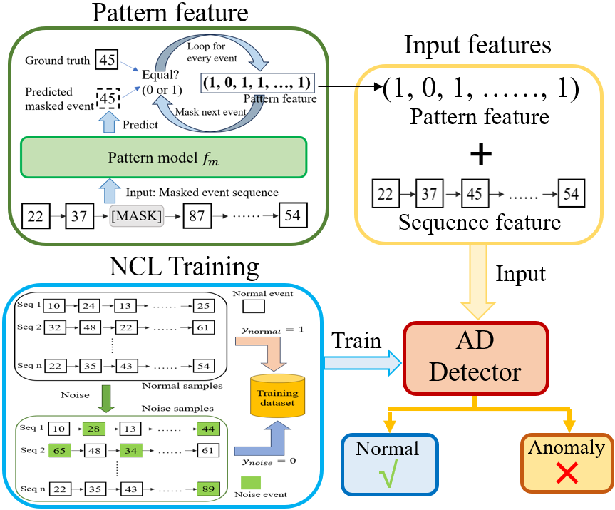

# PatternAD: System Log Anomaly Detection with Noise-Contrastive Learning and Pattern Feature

[中文 README](./README_CN.md)

We propose a novel method for anomaly detection in system log event sequences, named **PatternAD**. This approach leverages **Pattern Feature** and **Noise-Contrastive Learning (NCL)** to achieve efficient **Anomaly Detection (AD)**.  

- **Pattern Feature**: Learns contextual dependencies within log event sequences to identify whether a specific event is potentially anomalous.  
- **Noise-Contrastive Learning**: Directly determines whether the entire event sequence is anomalous through contrastive learning, avoiding predicting event as the intermediate task.  

To achieve lightweight inference, we have adjusted the design: **Pattern Model** is built using **CART decision trees**. **AD Detector** is implemented with **LightGBM**.  

<!--    -->


<!-- --- -->

## Environment Setup
Python version **3.10** or more. Install dependencies:  
```bash
pip install -r requirements.txt
```

<!-- --- -->

## Usage

Run the training and testing pipeline:  
```bash
python train_pattern_and_detector.py --dataset ${dataset} --test-num 5
```

- `${dataset}` options: `hdfs` / `bgl` / `hadoop`  
- `${test-num}` specifies the number of test runs  

<!-- --- -->

## Pre-processed Dataset Download

The datasets used in this project include HDFS, BGL, and Hadoop. Pre-processed datasets can be downloaded from [Kaggle](https://www.kaggle.com/datasets/luopeng1996/patternad-dataset). After unzipping, put the folder in the project **root directory** and **rename** it `dataset`.  

```
patternAD/
│
├── dataset/              # Place extracted datasets here
│   ├── hdfs/
│   ├── bgl/
│   └── hadoop/
│
├── train/                # Training scripts and modules
├── .gitignore
└── README.md
```

<!-- --- -->

## Raw Log Dataset
Raw log data comes from the [Anomaly Detection Log Datasets](https://github.com/ait-aecid/anomaly-detection-log-datasets/) repository. The `construct_dataset/` directory contains scripts to transform raw log data into the log event sequence format (pre-processed datasets) required by this project.  

- `create_dataset_short.py`: Processes the HDFS dataset  
- `create_dataset_short_bgl.py`: Processes the BGL and Hadoop datasets  
- `analysis_data_evaluation.py`: Simple analysis of duplicate samples in the datasets  


<!-- --- -->

## Method Overview

The following figure illustrates the training pipeline in PatternAD:  

<!-- - **Training Pipeline**   -->
<!--    -->


<!-- --- -->

## Citation

For more details, please refer to the following paper:  

```bibtex
@article{luo2025system,
  title={System Log Anomaly Detection with Noise-Contrastive Learning and Pattern Feature},
  author={Luo, Pengcheng and Deng, Dengke and Xie, Mingfeng and Yang, Genke and Chu, Jian and Soong, Boon-Hee and Yuen, Chau},
  journal={IEEE Transactions on Network Science and Engineering},
  year={2025},
  publisher={IEEE}
}
```
