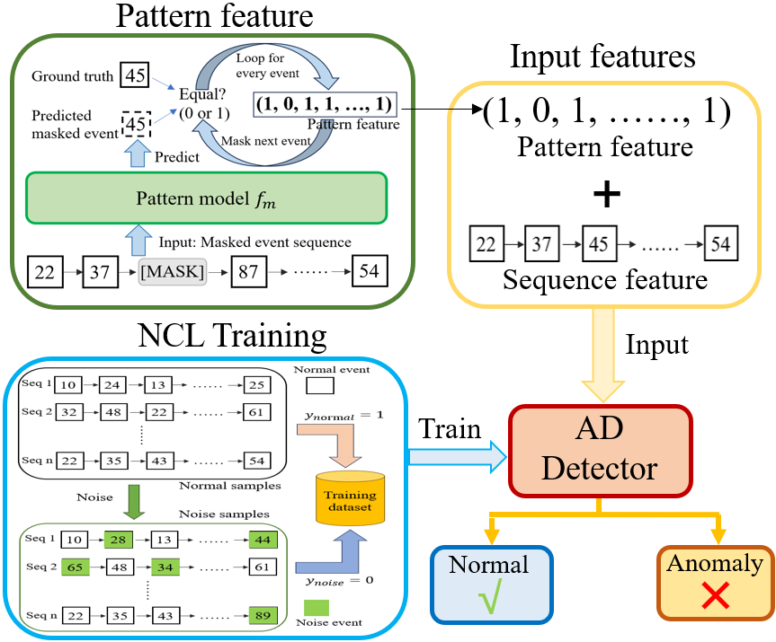
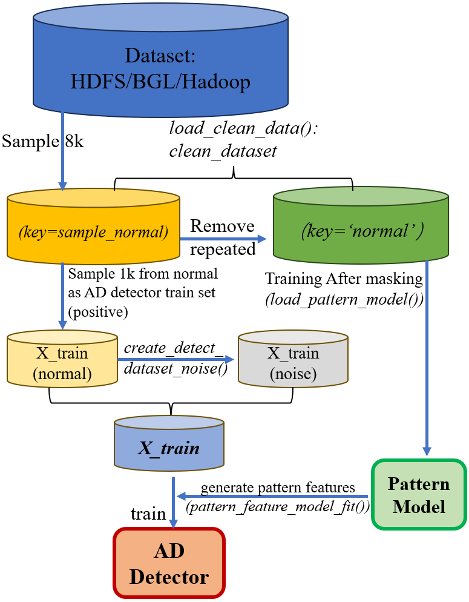

# PatternAD: System Log Anomaly Detection with Noise-Contrastive Learning and Pattern Feature

我们提出了一种针对系统日志事件序列异常检测的方法 **PatternAD**。该方法基于 **Pattern Feature** 与 **Noise-Contrastive Learning (NCL)** 实现了高效的 **Anomaly Detection (AD)**。  

- **Pattern Feature**：通过学习日志事件序列上下文的依赖关系，判断某一事件是否存在潜在异常。  
- **Noise-Contrastive Learning**：通过对比式学习，直接判断整个事件序列是否为异常，无需事件预测作为中间任务。  

为了实现轻量化推理，我们做了一些调整：**Pattern Model** 使用 **CART 决策树** 进行建模；**AD Detector** 使用 **LightGBM** 进行异常检测。  

   

<!-- --- -->


## 环境准备
Python 版本为 **3.10**。安装依赖：
```bash
pip install -r requirements.txt
```

<!-- --- -->

## 使用方法

运行训练与测试流程：
```bash
python train_pattern_and_detector.py --dataset ${dataset} --test-num 5
```

其中 `${dataset}` 可选`hdfs`/`bgl`/`hadoop`； `${test-num}` 为测试次数


<!-- --- -->

## 预处理数据集下载

本项目实验所用数据集包括**HDFS**, **BGL**, **Hadoop**。已处理好的数据集可从 [Kaggle 数据集](https://www.kaggle.com/datasets/luopeng1996/patternad-dataset) 下载，解压后放置在项目根目录下，目录名为 `dataset`。 
```
patternAD/
│
├── dataset/              # Place extracted datasets here
│   ├── hdfs/
│   ├── bgl/
│   └── hadoop/
│
├── train/                # Training scripts and modules
├── .gitignore
└── README.md
``` 
  

<!-- --- -->

## 数据集构建

原始日志数据来源于 [Anomaly Detection Log Datasets](https://github.com/ait-aecid/anomaly-detection-log-datasets/) 项目。`construct_dataset/` 目录下包含数据集处理脚本，用于将原始日志转化为本代码所需的日志事件序列(已处理的版本)格式。

- `create_dataset_short.py`：处理 HDFS 数据集
- `create_dataset_short_bgl.py`：处理 BGL 与 Hadoop 数据集  
- `analysis_data_evaluation.py`：用于简单分析数据集中重复样本数量  


## 方法概览
下图展示了 PatternAD 代码中的训练流程：  


<!--    -->


<!-- --- -->

## 引用

详细内容可参考以下论文：  

```bibtex
@article{luo2025system,
  title={System Log Anomaly Detection with Noise-Contrastive Learning and Pattern Feature},
  author={Luo, Pengcheng and Deng, Dengke and Xie, Mingfeng and Yang, Genke and Chu, Jian and Soong, Boon-Hee and Yuen, Chau},
  journal={IEEE Transactions on Network Science and Engineering},
  year={2025},
  publisher={IEEE}
}
```
